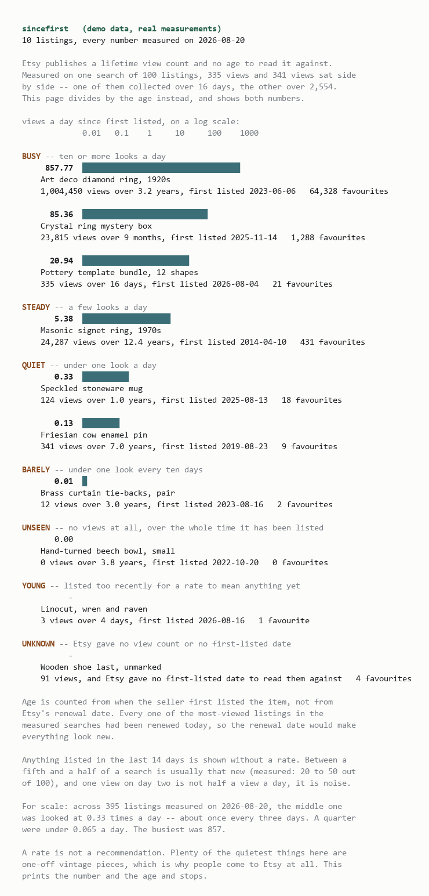

# sincefirst

How much has anyone actually looked at this Etsy listing?



## The thing it exists to get right

Etsy publishes a `views` figure on every search result. It is the one number on
a listing that looks like evidence of interest, and on its own it cannot be
read. Two listings that came back side by side in one measured search:

```
a pottery template bundle     335 views   over     16 days   =  20.9 a day
an enamel pin                 341 views   over  2,554 days   =  0.13 a day
```

Six views apart. **A hundred and sixty-four times apart** in what they mean.
The same search again on rings: 24,287 views collected over twelve years,
sitting next to 23,815 collected over nine months.

Etsy prints the left-hand column and never the right-hand one. sincefirst never
shows a view count without the age beside it, and sorts on the rate.

## For scale

Measured on 2026-08-20, 395 listings across six searches:

```
p25       0.065 a day
median    0.333 a day      <- the middle listing is looked at once every 3 days
p75       4.669 a day
p90      30.692 a day
max     857.4   a day

under  0.1 a day   32% of listings
under  1   a day   61%
under 10   a day   83%
```

The bands the program reports in — under 0.1, under 1, under 10, above — are
round numbers sitting on those quartiles, and they split the population
32 / 29 / 22 / 17.

## Three more things it is careful about

**The age is when the seller first listed the item, not Etsy's renewal date.**
Every one of the most-viewed listings in every search measured had been renewed
*that day*: `creation_timestamp` was today, `original_creation_timestamp` was
years ago. Dividing by the renewal date gives a rate of infinity for everything,
every morning. (`newdrop` was caught by the same field pair from the other
direction, and `tweaklog` by `last_modified` being a copy of it.)

**Zero views is two different facts.** About a third of every search comes back
with none at all — 34, 38 and 39 out of 100 in the searches measured. Zero on
something listed this morning says nothing; nobody has had the chance. Zero on
something listed four years ago is the loudest number on the page. Anything
under a fortnight old is shown with no rate, and **between a fifth and a half of
a search is usually that new** (measured: 20 to 50 out of 100).

**The bars are logarithmic, and the axis is printed.** The rates span 0.00 to
857 a day — over five orders of magnitude. On a linear scale everything except
the single busiest item is a bar of no width, which reads as "nobody looks at
any of these". A log scale nobody mentions is its own kind of lie, so the axis
is drawn above the bars.

## What it will not tell you

Whether to buy anything. Busy is not better and unseen is not worse — plenty of
the quietest things measured were one-off vintage pieces, which is why people
come to Etsy at all. A test fails the build if `trending`, `hidden gem`,
`bargain` or seven other words ever reach the screen.

## Use

Python 3.8 or newer. No dependencies.

```
python sincefirst.py                          the demo
python sincefirst.py find "linocut print"     a search, ranked by rate
python sincefirst.py look 982854797           one or more listing IDs
```

Set `ETSY_API_KEY` to `keystring:shared_secret` — **both halves**; the keystring
alone is a 403 that looks like a wrong key. With no key it prints a fixed demo
of ten listings, every number in it a real measurement, and says so at the top.

Nothing is written to disk. Each run asks Etsy, prints, and exits.

## Tests

```
python test_sincefirst.py     →  36/36 passed
```

Each rule is mutation-checked: dividing by `creation_timestamp`, dropping the
fortnight cutoff, drawing the bars linearly, treating a stale zero as a fresh
one, and letting a bool through as a view count all make the suite fail.

Two bugs the tests only caught after a live run: titles arrive HTML-escaped
(`&#39;` 21 times and `&quot;` 19 times across 300 live titles) and reach 150
characters, so they are decoded on the way in and **wrapped rather than cut**.

## Etsy

Public listing data only — no OAuth, no shop, no buyer data. One request per
search, one per twenty listing IDs, and only when the program is run.

The term "Etsy" is a trademark of Etsy, Inc. This application uses the Etsy API
but is not endorsed or certified by Etsy, Inc.
